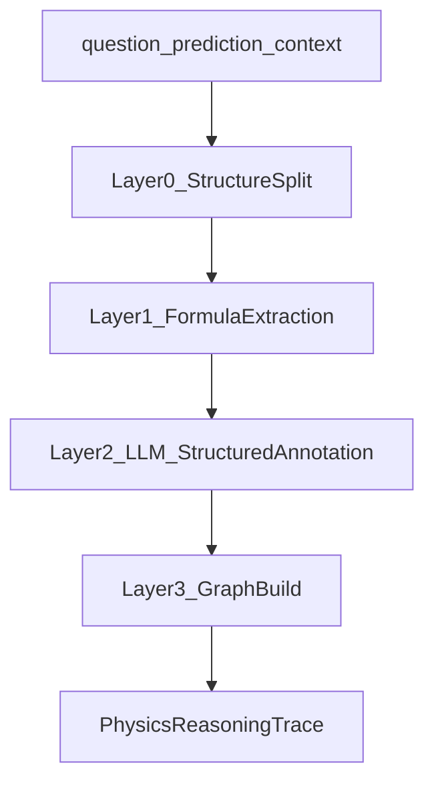

# 03 Physics Reasoning Trace (PRT)

## 1. 动机

当前系统从作答中抽取 `SymbolGraph`（符号与公式列表）供 LLM 语义检查使用，但**没有**显式的推理步骤、前提依赖与可验证 claim 结构。长期符号化路线需要将学生作答抽象为 **Physics Reasoning Trace (PRT)**：一段可部分形式化、可路由到验证后端的符号推理过程。

相关工作范式：

- **神经符号推理**：LLM 生成 → 符号 verifier 检查 → 结构化反馈（Geometry neuro-symbolic, LogicLM, HERMES）
- **物理形式化**：Lean4Physics、PhysProver 强调 unit system、dimensional homogeneity、machine-checkable steps
- **本项目定位**：先在 Python/SymPy 层做轻量验证，Lean 作为 Phase 4 可选模板库

## 2. PRT Schema

```json
{
  "sample_id": "cl_104_24899",
  "problem_context": {
    "given": [
      {"id": "G1", "kind": "symbolic", "text": "binary separation 2a", "span": {}}
    ],
    "asked": [
      {"id": "Q1", "target": "dE/dt", "text": "energy loss rate"}
    ]
  },
  "symbols": {
    "v_bin": {"role": "derived", "unit": "m/s", "introduced_at": "S2", "aliases": []},
    "a": {"role": "parameter", "unit": "m", "introduced_at": "G1"}
  },
  "steps": [
    {
      "id": "S2",
      "kind": "derive",
      "nl_text": "For circular orbit...",
      "span": {"start_char": 120, "end_char": 210},
      "premises": ["G1", "S1"],
      "equations": [
        {"id": "E2", "raw": "v_{bin} = \\sqrt{GM/(2a)}", "sympy": null, "relation": "eq"}
      ],
      "claims": [
        {"id": "C2", "type": "equality", "expr": "v_bin = sqrt(G*M/(2*a))"}
      ],
      "physics_tags": ["orbital_mechanics", "circular_orbit"]
    }
  ],
  "conclusions": [
    {"id": "F1", "expr": "dE/dt = ...", "refs": ["S5"]}
  ],
  "edges": [
    {"from": "S1", "to": "S2", "type": "uses"},
    {"from": "S2", "to": "S5", "type": "uses"}
  ],
  "parse_stats": {
    "formula_count": 12,
    "parsed_count": 8,
    "parse_failure_ids": ["E4"]
  }
}
```

### 2.1 与现有 SymbolGraph 的关系

| 字段 | SymbolGraph（现有） | PRT（目标） |
|------|---------------------|-------------|
| 符号列表 | ✓ | ✓（扩展 unit/role） |
| 公式 raw LaTeX | ✓ | ✓（挂到 step） |
| 步骤边界 | ✗ | ✓ |
| 前提依赖 | ✗ | ✓ |
| claim 类型 | ✗ | ✓ |
| 字符 span | 部分 | ✓（对齐 diagnostic quote） |

PRT 是 SymbolGraph 的超集；`SemanticRuleChecker._create_context_summary` 可逐步升级为 `prt_summary`。

## 3. 抽取流水线



### Layer 0 — 结构切分（确定性）

- 复用 `SemanticRuleChecker._extract_symbols_and_formulas`
- 按空行、编号（1./(a)/Step）、`\boxed`、结论句切分 step 候选
- 从 question 抽取 given/asked（数值+单位、条件句）

### Layer 1 — 公式解析（SymPy）

- 调用 `symbolic/symbolic_system.py` 的 `FormulaParser.parse`
- 复用 `symbolic/match_utils.py` 做希腊字母归一
- 解析失败标记 `parsing_errors`，不阻断 PRT 构建

### Layer 2 — LLM 结构化标注（神经）

- Step typing：model / derive / substitute / approx / conclude
- Premise linking：每步引用哪些 given 或前序 step
- Physics tags：与规则库 trigger 词汇表对齐
- **约束**：LLM 输出必须有 span 锚点，无锚点的 step 丢弃

### Layer 3 — 图构建与冲突检测

- 扩展 `rules/graph_consistency.py` 思路：
  - 同符号多定义且 RHS 不等价 → `contradicts` 边
  - 未定义即使用、自引用
  - 结论是否从 given 经 steps 可达

## 4. 验证路由

PRT 构建完成后，`VerificationRouter` 按 fragment 类型分发：

| PRT fragment | verify_kind | 后端 |
|--------------|-------------|------|
| equation in step | sympy_equiv | SymPy |
| equality with units | dimensional_homogeneity | 量纲系统 |
| inequality / domain | z3_constraint | SMT/Z3 |
| canonical pattern | pattern | 现有 primitive |
| modeling tag only | none | 仍走 SemanticRuleChecker |

## 5. 示例：cl_104_24899 片段

**Step S2** 含错误公式 `v_bin = sqrt(GM/(2a))`：

1. Layer 1 解析为 SymPy（或失败 → no_signal）
2. Router 调用 `equation_equivalence_sympy`，canonical `sqrt(GM/(4a))`
3. 返回 `supports_error`，`target_error_id: cl_104_24899_e1`，span 指向 S2 公式

**Step S5** 含 `da/dt ∝ a^4`：

1. `power_exponent_check`，expected 2
2. 返回 `supports_error`，`target_error_id: cl_104_24899_e8`

## 6. 实现阶段

| 阶段 | 内容 | 产出 |
|------|------|------|
| Phase 0（当前） | 小样本 declarative spec，不建完整 PRT | experiment_manifest.json |
| Phase 1 | PRT MVP：Layer 0–1 + 简化 Layer 2 | `core/reasoning_trace/` 模块 |
| Phase 2 | VerificationRouter + 声明式 symbolic_hint v2 | 与 PhysicsRuleVerifier 衔接 |
| Phase 3 | Z3 约束 + 跨步一致性 | 区间/正负根类规则 |
| Phase 4 | Lean 模板库（可选） | 守恒/矢量恒等式 |

## 7. 暂不实现

- 整题自动 Lean 形式化
- 开放建模问题的完全证明
- 1500 规则库逐条 PRT 绑定

## 8. 相关代码

- 公式解析：[`symbolic/symbolic_system.py`](../../symbolic/symbolic_system.py) — `FormulaParser`, `EnrichedSymbolGraph`
- 符号抽取：[`core/semantic_rule_checker.py`](../../core/semantic_rule_checker.py) — `_extract_symbols_and_formulas`, `SymbolGraph`
- 图一致性：[`rules/graph_consistency.py`](../../rules/graph_consistency.py)
