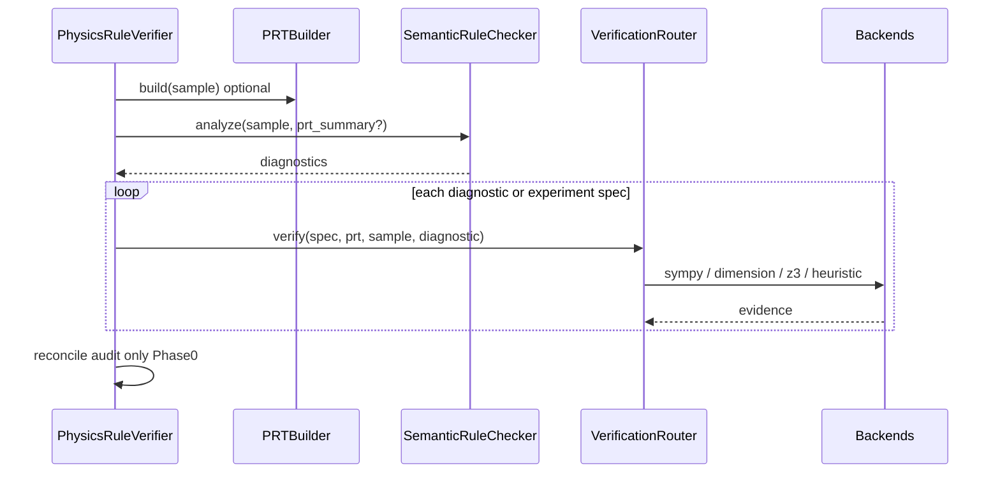

# 05 与现有流水线衔接

## 1. 当前主流程

```
run_verifier.py
  → PhysicsRuleVerifier.verify(sample)
      1) 规则检索 (rule_catalog_retrieval)
      2) SemanticRuleChecker.analyze → diagnostics
      3) 低置信过滤
      4) ExperienceCodeEngine.run_rule → symbolic reconcile
      5) release_gate + aggregator/validator
  → error_symbolic_audit.json
```

关键文件：

- [`core/physics_rule_verifier.py`](../../core/physics_rule_verifier.py) — `verify()`, `_diagnostic_release_gate`
- [`core/semantic_rule_checker.py`](../../core/semantic_rule_checker.py) — `analyze()`, `SymbolGraph`
- [`symbolic/experience_code_engine.py`](../../symbolic/experience_code_engine.py) — `run_rule()`
- [`scripts/run_verifier.py`](../../scripts/run_verifier.py) — `_build_symbolic_audit()`

## 2. 目标架构（渐进接入）



## 3. 分阶段衔接

### Phase 0（当前）：离线小样本实验

- **不修改** `PhysicsRuleVerifier.verify`
- 独立脚本读取 `experiment_manifest.json`，输出 `results/symbolic_small_sample_v1/audit.json`
- 与 semantic checker 结果人工/脚本对照

### Phase 1：PRT summary 注入语义

**改动点**：`SemanticRuleChecker.analyze`

```python
def analyze(self, sample, prt: Optional[PhysicsReasoningTrace] = None):
    context_summary = self._create_context_summary(sample, prt=prt)
    ...
```

- `_create_context_summary` 增加 `steps[]`（id, kind, equation ids）
- LLM prompt 可选引用 `step_id`；保留原有 `quote` 字段向后兼容

**改动点**：`PhysicsRuleVerifier.verify` 开头

```python
prt = self.prt_builder.build(sample_for_check) if self.enable_prt else None
diagnostics = self.semantic_checker.analyze(sample, prt=prt)
```

### Phase 2：VerificationRouter 并行 ExperienceCodeEngine

**改动点**：`PhysicsRuleVerifier.verify` 符号阶段

```python
# 现有
if self.experience_code_engine.has_rule(rid):
    res = self.experience_code_engine.run_rule(rid, sample_for_check)

# 新增（rule.symbolic_hint.verify_kind 存在时）
if spec := self._declarative_spec_for_rule(rule_obj):
    res = self.verification_router.verify(spec, prt, sample_for_check, diagnostic=d)
```

- manifest 双轨：`experience_code`（heuristic）+ `declarative_spec`（SymPy/量纲）
- reconcile 逻辑**不变**：仍认 pass/fail/inconclusive 三态

### Phase 3：audit 扩展

**改动点**：`run_verifier._build_symbolic_audit`

增加字段：

```json
{
  "verification_trace": [
    {
      "backend": "sympy",
      "experiment_id": "...",
      "result": "supports_error",
      "target_error_id": "..."
    }
  ],
  "prt_stats": {"steps": 5, "parsed_formulas": 3}
}
```

主 diagnostics JSON 仍剥离 symbolic 字段（现有 `_strip_symbolic_fields_from_diagnostic`）。

## 4. RuleContext 扩展

[`rules/base.py`](../../rules/base.py) 中 `RuleContext` 规划字段：

```python
@dataclass
class RuleContext:
    text_all: str
    prt: Optional[Any] = None
    step_index: Optional[Dict[str, Any]] = None
```

`GraphConsistencyRule` 可读 PRT 或 enriched graph。

## 5. symbolic_hint v2 扩展

规则叶子字段（规划）：

```json
{
  "primitive": "equation_equivalence",
  "canonical": "...",
  "required_symbols": ["v", "a", "G", "M"],
  "verify_kind": "sympy_equiv",
  "canonical_sympy": "Eq(v, sqrt(G*M/(4*a)))",
  "unit_signature": {},
  "z3_constraints": [],
  "prt_scope": "step"
}
```

离线生成：[`scripts/generate_symbolic_checks.py`](../../scripts/generate_symbolic_checks.py) 双轨输出 heuristic code 或 declarative JSON。

## 6. 1500 规则库约束

- 当前 **无** 1500 符号 manifest → `ExperienceCodeEngine.available` 对 norm_* 规则为 false 是预期
- Phase 0–1 **不要求** 生成 1500 符号代码
- 完整测评待 `generate_symbolic_checks.py` 对 unified catalog 运行后再评估

## 7. 评测衔接

| 脚本 | 用途 |
|------|------|
| `scripts/evaluate_physics_eval_sets.py` | location / semantic 匹配 |
| `scripts/recall_cause_diagnostics.py` | semantic_gap / near_miss 归因 |
| `scripts/analyze_symbolic_candidate_errors.py` | 符号候选筛选 |
| （规划）`scripts/run_symbolic_small_sample_experiment.py` | 小样本符号 audit |

新增指标（形式化层专用）：

- parse_success_rate
- hard_evidence_rate
- evidence_precision（对照 target_error_id）
- symbolic_gap_recovery

## 8. 与 release gate 的关系

Phase 0：**不接入** release gate，symbolic 仅 audit。

Phase 1+：见 [06_reconciliation_policy.md](06_reconciliation_policy.md)。

## 9. 最小侵入原则

1. 不推翻「检索 → 语义 → 符号复核 → 合并」顺序
2. PRT 为可选增强，构建失败不阻断语义
3. 新后端与 ExperienceCodeEngine 并存
4. diagnostic 协议向后兼容（quote + location）
