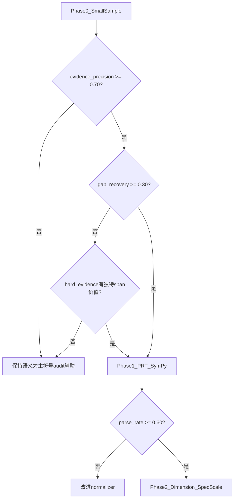

# 07 风险、路线与 Go/No-Go

## 1. 风险矩阵

| 风险 | 表现 | 缓解 |
|------|------|------|
| 抽取错误传播 | 错误 premise 链接导致 SymPy/Z3 误报 | span 锚点；解析失败 → no_signal |
| 覆盖缺口 | 大量步骤仍是自然语言 | 建模类走语义；形式化只覆盖可解析子图 |
| LaTeX 歧义 | SymPy parse 失败率高 | normalizer；pattern fallback |
| 规则情境错配 | 检索规则与题面不符 | PRT physics_tags 重排；trigger 门控 |
| 重复语义 | 符号只做概念判断 | 聚焦 formula/dimension/constraint |
| 误抑制 | pass suppress 真错误 | 证据分层；Phase 0 不 suppress |
| 评测口径 | 标注噪声 13.4% | 小样本人工核对 target_error_id |
| 工程复杂度 | Lean 集成成本高 | Phase 4 可选；SymPy+量纲优先 |
| 1500 符号未生成 | 无法全库测评 | 承认约束；小样本先行 |

## 2. 四阶段路线

### Phase 0（当前，0–1 个月）

**目标**：验证符号层独特价值是否存在

- [x] 纯语义结果分析 → `01_semantic_result_analysis.md`
- [x] 小样本 manifest → `experiment_manifest.json`
- [x] 候选分析脚本 → `analyze_symbolic_candidate_errors.py`
- [ ] 离线运行 declarative specs → `results/symbolic_small_sample_v1/audit.json`
- [ ] 计算 evidence_precision / gap_recovery

**交付物**：Go/No-Go 决策报告

**不交付**：1500 符号代码、主流程改动、release gate 改造

### Phase 1（1–3 个月）

**目标**：PRT MVP + SymPy 试点

- PRT Builder（Layer 0–1 + 简化 Layer 2）
- `VerificationRouter` 骨架 + SymPy backend
- 20–50 条高价值 declarative specs（非全库）
- 接入 `SemanticRuleChecker` context summary
- audit 扩展字段

**指标**：

- PRT 构建成功率 ≥ 80%
- SymPy parse 率 ≥ 60%（公式代数类）
- 小样本 evidence_precision ≥ 0.70

### Phase 2（3–6 个月）

**目标**：量纲系统 + 声明式 spec 规模化

- dimension backend
- `symbolic_hint.verify_kind` 规范
- 与 ExperienceCodeEngine 双轨 manifest
- reconcile 证据分层（hard supports only）

**指标**：

- 量纲类 GT 的 hard evidence rate
- FP 中 rule_too_broad 是否因符号 refute 减少（谨慎评估）

### Phase 3（6–12 个月）

**目标**：Z3 约束 + 跨步一致性

- 区间/正负根/分段条件
- PRT 图定义冲突检测
- 检索侧 PRT tags 重排

### Phase 4（12 个月+，可选）

**目标**：Lean 模板库

- 经典守恒/矢量分解小型库
- 仅 verify_kind=lean 且模板命中

## 3. Go / No-Go 标准

### 3.1 Phase 0 → Phase 1（继续）

| 条件 | 阈值 |
|------|------|
| hard evidence precision | ≥ 0.70 |
| semantic_gap recovery | ≥ 0.30（symbolizable+gap 子集） |
| suppression_risk | 0（未启用 suppress） |
| no_signal 可解释 | 主因 non-symbolizable GT |
| 手写 spec 数量 | ≤ 30 条覆盖 6 样本 |

### 3.2 Phase 0 → 暂停（符号层保持 audit 辅助）

| 条件 | 说明 |
|------|------|
| evidence 重复语义 | 无 span/硬证据提升 |
| parse_failure_rate | > 0.50 |
| 每题专属规则 | 无法声明式复用 |
| 维护 normalizer 成本 | 超过收益 |

### 3.3 Phase 1 → Phase 2

- SymPy backend 稳定，parse 率达标
- 至少 2 类 primitive（equiv + dimension）有效
- 无显著 refute 误抑制（若已启用 hard refute）

## 4. 决策检查点

## 5. 资源与依赖

| 依赖 | 说明 |
|------|------|
| SymPy | 已有 `symbolic_system.py` |
| Pint / SymPy units | Phase 2 量纲 |
| z3-solver | Phase 3 约束 |
| Lean 4 | Phase 4 可选 |
| 1500 unified catalog | 符号代码生成（Phase 2+ 规模化时） |

## 6. 文档维护

本目录文档随阶段更新：

- Phase 0 完成 → 在 `02_small_sample_experiment_plan.md` 追加实验结果表
- Phase 1 启动 → 更新 `05_integration` 中的代码插入点（实现后）
- Go/No-Go 决策 → 写入 `results/symbolic_small_sample_v1/decision_report.md`

## 7. 相关评测资产

| 路径 | 用途 |
|------|------|
| `results/recall_attribution_v1/final_report/` | 语义/规则归因 |
| `results/semantic_pure_check_cleaned_1500/` | 纯语义 baseline |
| `results/scale_curve_error_v2_local_30b/scale_1500_cleaned/` | 规则语义 baseline |
| `data/derived/symbolic_small_sample_experiment_v1/` | 符号小样本实验 |

## 8. 总结

符号检查模块的合理演进路径是：

1. **承认**语义已强、1500 符号未就绪；
2. **小样本证明**公式/量纲/约束硬证据的独特价值；
3. **PRT + 多后端**渐进接入，保守 reconcile；
4. **全库符号化**仅在 Phase 0/1 Go 之后考虑。

若 Phase 0 未达标，符号层应定位为 **audit 辅助与 FP 佐证**，而非主判定链路。
