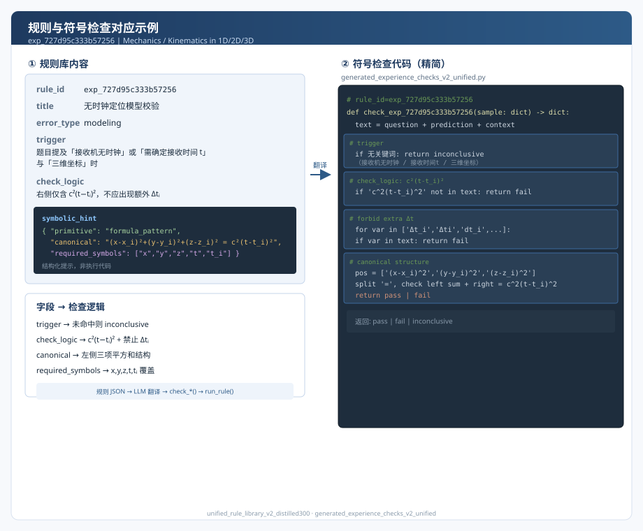
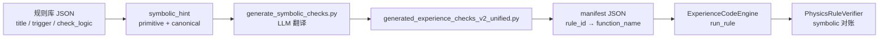

# 规则与符号检查代码对应示例



本文用**一条**经验规则，说明规则库中的自然语言规则内容如何落到可执行的符号检查 Python 函数，并在端到端验证流程中被调用。

---

## 1. 规则在库中的完整内容

来源：`catalogs/unified_rule_library_v2_distilled300_20260503.json`  
规则 ID：`exp_727d95c333b57256`

| 字段 | 内容 |
|------|------|
| **domain** | Mechanics |
| **topic** | Kinematics in 1D/2D/3D |
| **title** | 无时钟定位模型校验 |
| **trigger** | 题目提及“接收机无时钟”或“需确定接收时间t”与“三维坐标”时 |
| **check_logic** | 检查方程右侧是否仅包含光速 c 与 (t−tᵢ) 的差值平方，不应出现额外的观测时间差变量 Δtᵢ。 |
| **error_type** | modeling |

**symbolic_hint**（生成符号检查时的结构化提示，非最终执行代码）：

```json
{
  "primitive": "formula_pattern",
  "canonical": "(x-x_i)^2 + (y-y_i)^2 + (z-z_i)^2 = c^2(t-t_i)^2",
  "required_symbols": ["x", "y", "z", "t", "t_i"]
}
```

---

## 2. 对应的符号检查代码

由 `scripts/generate_symbolic_checks.py` 根据上述规则（含 `symbolic_hint`）翻译生成，写入：

- **模块**：`symbolic/generated_experience_checks_v2_unified.py`
- **函数名**：`check_exp_727d95c333b57256_828b0d6aa046`
- **清单注册**：`results/experience_symbolic_program_manifest_v2_unified.json` 中 `rule_id` → `function_name` 映射

```python
# rule_id=exp_727d95c333b57256 | domain=Mechanics | topic=Kinematics in 1D/2D/3D
def check_exp_727d95c333b57256_828b0d6aa046(sample: dict) -> dict:
    question = sample.get('question', '').lower()
    prediction = sample.get('prediction', '')
    context = sample.get('context', '')
    text = (question + ' ' + prediction + ' ' + context).strip()

    # 对应 trigger：未命中则不做判定
    if '接收机无时钟' not in text and '需确定接收时间t' not in text and '三维坐标' not in text:
        return {'result': 'inconclusive', 'message': '未触发规则条件', 'evidence': ''}

    # 对应 check_logic + canonical：右侧应为 c^2(t-t_i)^2
    c_t_term = 'c^2(t-t_i)^2' in text or 'c^2*(t-t_i)^2' in text
    if not c_t_term:
        return {'result': 'fail', 'message': '未发现c^2(t-t_i)^2项', 'evidence': ''}

    # 对应 check_logic：禁止额外观测时间差 Δt_i 等
    time_diff_vars = ['Δt_i', 'Δti', 'dt_i', 'delta_t_i', 'Δt', 'dt', 'delta_t']
    for var in time_diff_vars:
        if var in text:
            return {'result': 'fail', 'message': f'发现非法时间差变量: {var}', 'evidence': var}

    # 对应 canonical 左侧三项
    pos_terms = ['(x-x_i)^2', '(y-y_i)^2', '(z-z_i)^2']
    missing_pos = [term for term in pos_terms if term not in text]
    if missing_pos:
        return {'result': 'fail', 'message': f'缺少位置项: {missing_pos}', 'evidence': missing_pos[0]}

    if '=' not in text:
        return {'result': 'fail', 'message': '缺少等号', 'evidence': ''}

    left, right = text.split('=', 1)
    left = left.strip()
    right = right.strip()

    if not (right == 'c^2(t-t_i)^2' or right == 'c^2*(t-t_i)^2'):
        return {'result': 'fail', 'message': '右侧应为c^2(t-t_i)^2', 'evidence': right}

    if not all(term in left for term in pos_terms):
        return {'result': 'fail', 'message': '左侧缺少位置平方项', 'evidence': ''}

    if '+' not in left or left.count('+') != 2:
        return {'result': 'fail', 'message': '左侧应为三项加和', 'evidence': ''}

    return {'result': 'pass', 'message': '符合无时钟定位模型标准形式', 'evidence': 'c^2(t-t_i)^2'}
```

**函数约定**：输入 `sample` 含 `question` / `prediction` / `context` / `answer`；返回 `{"result": "pass"|"fail"|"inconclusive", "message": str, "evidence": str}`。

---

## 3. 规则字段与检查逻辑的对应关系

| 规则字段 | 符号检查中的实现 |
|----------|------------------|
| `trigger` | 第 366–367 行：题干/作答中须出现“接收机无时钟”“需确定接收时间t”“三维坐标”之一 |
| `check_logic`（右侧仅含 c²(t−tᵢ)²） | 第 374–376、398–400 行：检测 `c^2(t-t_i)^2` 及等号右侧形态 |
| `check_logic`（禁止 Δtᵢ） | 第 378–382 行：枚举 `Δt_i`、`Δti` 等非法变量 |
| `symbolic_hint.canonical` | 第 385–408 行：左侧三项平方和、右侧光速项、等号结构 |
| `symbolic_hint.required_symbols` | 通过 `x,y,z,t,t_i` 出现在公式字符串中间接覆盖 |

---

## 4. 在验证流水线中的调用方式

当 LLM 语义诊断命中 `exp_727d95c333b57256` 时，`PhysicsRuleVerifier` 经 `ExperienceCodeEngine` 加载 manifest 中的函数并执行：

```python
# core/physics_rule_verifier.py（节选）
if self.experience_code_engine.has_rule(rid):
    res = self.experience_code_engine.run_rule(rid, sample_for_check)
    payload = {
        "rule": f"experience_code::{rid}",
        "rule_id": rid,
        "primitive": "experience_code",
        "result": res.get("result", "inconclusive"),
        ...
    }
```

**结果语义**（与 `rules/symbolic_checks.py` 中轻量 primitive 执行器一致）：

- **pass**：作答已满足规则所要求的公式/结构 → 可**抑制**对应 LLM 诊断（认为符号层面未支持“有错”）。
- **fail**：明显缺少 canonical 或违反 check_logic → **支持** LLM 诊断。
- **inconclusive**：未触发或证据不足 → 保留诊断，标记符号证据不强。

---

## 5. 从规则到代码的生成链路（本例）



重新生成符号检查（需配置 `OPENAI_API_KEY`）：

```bash
python scripts/generate_symbolic_checks.py \
  --catalog catalogs/unified_rule_library_v2_distilled300_20260503.json \
  --output-module symbolic.generated_experience_checks_v2_unified \
  --manifest results/experience_symbolic_program_manifest_v2_unified.json
```

---

## 6. 补充：轻量 primitive 与经验代码两种路径

同一规则库中的 `symbolic_hint.primitive` 也可走**不生成 Python** 的轻量路径（`rules/symbolic_checks.py` 的 `GeneratedSymbolicCheckExecutor`），例如 `formula_pattern` 只检查 `required_symbols` 是否出现在全文：

```python
# rules/symbolic_checks.py — formula_pattern 分支（节选）
if primitive == "formula_pattern":
    req = params.get("required_symbols") or []
    present = [t for t in req if _token_present(t, text_lower, text_norm)]
    if not missing:
        return "pass", details
```

本仓库端到端默认启用的是**经验代码路径**（第 2 节完整函数），语义更贴近 `check_logic`；`symbolic_hint` 主要约束生成时的公式与符号焦点。
